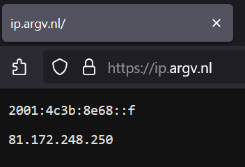
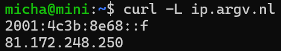

# What's my IP? (good question)

(probably) an ipv4 and/or ipv6 address, or not, who knows?

## Features

- IPv4 **and** IPv6 support (like, seriously, not IPv4 *or* IPv6, but, both at once)
- Browser and CLI support

<sub><sup>(so sorry for the ones having these ips after me)</sup></sub>
- No dependencies (except for the built-in `node:http` module)
<sub><sup>(apparently that's a feature, according to Copilot, it's nice that it isn't bloated with Express ig)</sup></sub>
- Dark mode support
- Viewport tag included (no need for squinting when on mobile)
- 1-click IP selection (instead of double clicking and cursing your browser for only selecting half of it)

## Usage

### Browser

- visit [ip.argv.nl](https://ip.argv.nl/)

### CLI

```ShellSession
micha@mini:~$ curl -L ip.argv.nl  # include `-L` for both ipv6 and ipv4
2001:4c3b:8e68::f
81.172.248.250
```
